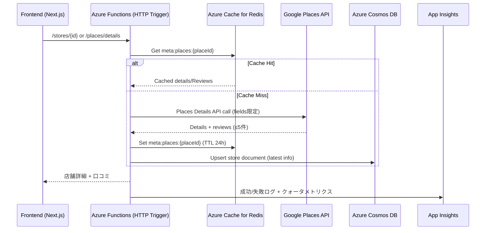
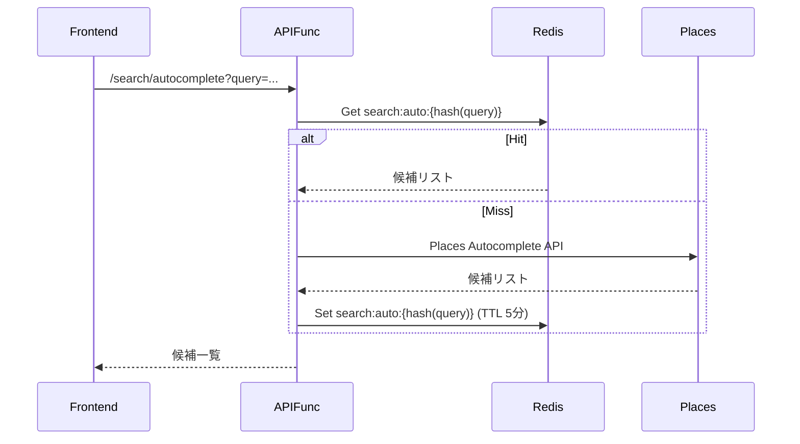

# データフロー: Google Places 詳細 / 口コミ取得

## 1. 背景
- Google Places API (Details / Autocomplete) を利用して最新の店舗情報と口コミを取得し、Cosmos DB と Redis に反映する。
- 参考資料: `architecture/ArchitectureCurrent.md`, `architecture/APIQuotaPlan.md`, `architecture/CacheStrategy.md`, `operations/gcp/GoogleCloudSetup.md`.

## 2. シーケンス概要

## 3. 詳細ステップ
1. **トリガー**
   - フロントの店舗詳細画面、またはバックエンドのバッチ更新から Functions API が呼ばれる。

2. **キャッシュ確認**
   - Redis `meta:places:{placeId}` キーをチェック。存在すれば即返却。
   - 無ければGoogle Places APIへリクエスト。`fields=place_id,name,geometry,opening_hours,reviews,rating,price_level,photos` など必要項目に限定。

3. **レスポンス処理**
   - レビューは最新5件のみ保持。レビュアー名・投稿日を含む。
   - 画像URL・営業時間などを正規化し、Functions内のDTOに変換。

4. **永続化 / キャッシュ**
   - Cosmos DBの `stores` コレクションへ upsert（Places由来フィールド更新）。
- Redisに24時間TTLで保存（Googleポリシーに基づき長期保存しない）。口コミはAPIレスポンスのまま最大5件に限定し、レビュアー名・投稿日を必ず保持。
- クォータ80%到達時はTTLを延ばして呼び出しを抑制。

5. **エラー / フェイルバック**
   - Places APIが失敗した場合は、Cosmosの最後のデータを返す。
   - 連続失敗時は `architecture/APIQuotaPlan.md` に沿ってアラート→キャッシュ延長→利用者へ通知。

## 4. Autocomplete フロー

## 5. アラート / クォータ管理
- Google Cloud BillingのBudgetsで 50% / 80% / 100% 通知を送信。
- Application InsightsのカスタムメトリクスでAPIコール数・エラー率をトラッキング。
- 80%超過時はキャッシュTTL延長、Autocomplete入力回数制限など緊急対策を適用。

## 6. 次のアクション
1. Functions側にキャッシュインターフェースを実装し、Redis未導入環境ではメモリスタブで置換。
2. レスポンスDTOとCosmosスキーマを定義（Places由来フィールドのマッピング表含む）。
3. アラート設定（Google Budgets / App Insights）を `architecture/APIQuotaPlan.md` に合わせて自動化。
