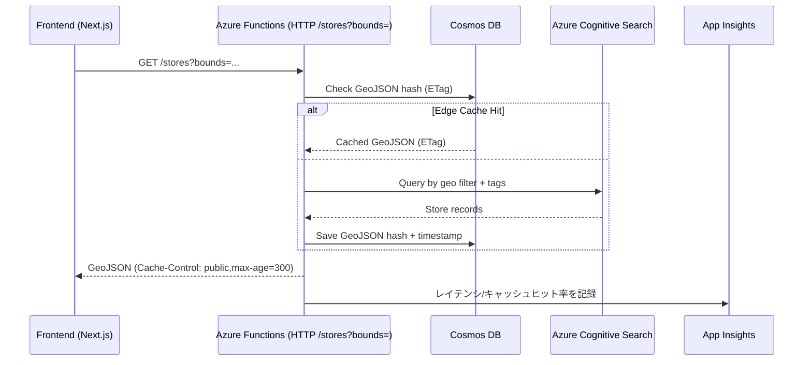

# データフロー: Map描画データ生成 / キャッシュ

## 1. 目的

- 地図表示エリアに応じて店舗データを高速に返し、Google Maps/Places への無駄なリクエストを削減する。
- 静的キャッシュ (SWA/CDN) + ブラウザ IndexedDB を中心に高速化し、サーバ側キャッシュを最小限にする。

## 2. シーケンス概要

## 3. 詳細ステップ

1. **リクエスト受付**
   - フロントは地図表示範囲（緯度経度の矩形）とフィルタ条件をクエリパラメータで送信。Front Doorで短期キャッシュ可。

2. **キャッシュチェック**
   - Cosmosに保存している `boundsHash` と `lastGenerated` を確認。5分以内であれば既存GeoJSONを再利用。
   - レスポンスには `Cache-Control` を付け、Static Web Apps/CDNが短期キャッシュ。

3. **データ生成（キャッシュミス時）**
   - Azure Cognitive Searchで地理フィルタ＋タグ/設備の条件検索。
   - 必要に応じてCosmos DBから追加フィールド（AI要約、お気に入り件数）を取得。
   - GeoJSONを生成し、Cosmosドキュメントに保存。ETagを更新し、クライアントはIndexedDBで保持。

4. **レスポンス / フロント側描画**
   - ピン位置（lat/lng）、雰囲気タグ、混雑指標を含むGeoJSONを返す。
   - フロントはGoogle Maps JavaScript APIでピン描画、広告ピンには「広告」ラベルを付与。

5. **監視・アラート**
   - Application Insightsにキャッシュヒット率、レスポンスタイムを記録。
   - キャッシュミスが続く場合はTTLを延長 or bounds分割ロジックを調整。

## 4. フェイルバック

- Cognitive Search でエラー発生時はCosmos DBの簡易クエリで最低限の店舗一覧を返却。
- サーバ側キャッシュは持たないため、Functionsでのメモリキャッシュは任意。必要なら短TTLの辞書を利用。

## 5. TODO / 次アクション

1. GeoJSON生成ロジックを共通化し、テストを作成。
2. Front Door を導入する場合、Cache-Controlヘッダーを設定してエッジキャッシュを有効化。
3. Boundsハッシュ・フィルタハッシュのアルゴリズムをドキュメント化（クライアント/サーバで共通化）。
4. キャッシュヒット率のメトリクスをダッシュボード化し、80%以上を目標とする。
