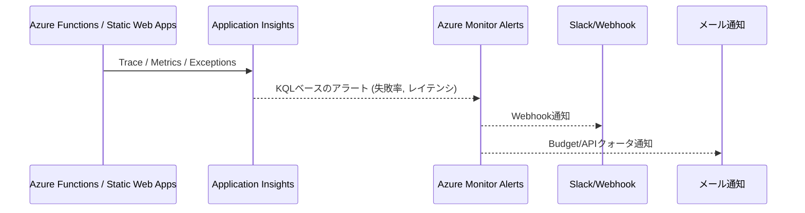

# データフロー: 監視・アラート

## 1. 目的
- Azure Monitor / Application Insights と外部アラート（メール/Slack）を用いて、APIエラー、クォータ到達、コスト超過を即座に検知する。
- 参照: `operations/azure/AzureCostAlerts.md`, `architecture/APIQuotaPlan.md`, `architecture/ArchitectureCurrent.md`.

## 2. シーケンス概要

## 3. 監視対象
| 種別 | 監視内容 | しきい値 / アクション |
| --- | --- | --- |
| APIエラー率 | HTTP 5xx, Functions失敗 | 5分平均1%以上でSlack通知、連続3回でメール |
| レイテンシ | `/stores`, `/favorites` のP95 | 2秒超でSlack、3秒超は即調査 |
| バッチ失敗 | SNS収集/AI要約/Places更新 | 1回失敗でメール、再実行後も失敗で手動介入 |
| Google Mapsクォータ | 80% / 100% | 80%=Slack、100%=メール+機能制限 |
| Instagram API | 連続失敗10回、トークン期限30日前 | Slack/メールで更新促進 |
| コスト | Azure/Azure Functions/Maps予算 | `operations/azure/AzureCostAlerts.md` に準拠 |

## 4. 実装メモ
- Application Insights: カスタムイベント `api_request`, `batch_run` を送信し、KQLクエリで成功/失敗数を集計。
- Azure Monitor: アクショングループにメール・Slack Webhookを登録。予算アラートはAzure Cost Managementで設定。
- Google Maps/Instagram: `architecture/APIQuotaPlan.md` のBudgets/Insights画面を週次確認し、APIコール数メトリクスをダッシュボード化。
- Functionsコード内で例外を`ILogger`に送出し、AppInsightsでトレースを追跡できるようにする。

## 5. TODO
1. App InsightsのKQLテンプレート（失敗率、レイテンシ）をリポジトリに保存。
2. Slack Webhook / メール（Azure Monitor アクショングループ）の設定を運用者と共有。
3. Google/Instagramのダッシュボードキャプチャと確認フローを `architecture/APIQuotaPlan.md` に追記。
4. 重大アラート発生時のRunbookを整備し、対応手順を `docs/product/Roadmap.md` 付録へ記載。
