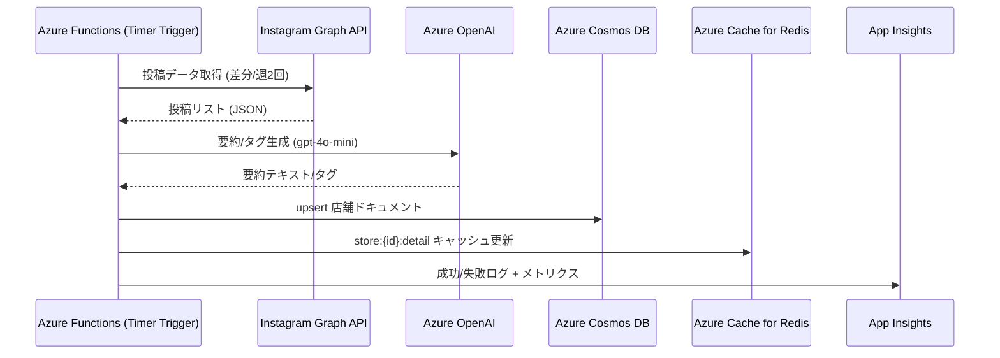

# データフロー: SNS収集 → AI要約 → 永続化

## 1. 背景
- InstagramやGoogle Placesなどの公開情報を統合し、雰囲気タグや要約を生成してCosmos DBに保存する。
- 参照ドキュメント: `architecture/ArchitectureCurrent.md`, `operations/meta/InstagramSetup.md`, `architecture/APIQuotaPlan.md`, `architecture/CacheStrategy.md`.

## 2. シーケンス概要

## 3. 詳細ステップ
1. **トリガー & 差分抽出**
   - タイマートリガーFunctionsが週2回起動。
   - Instagram Graph APIを呼び出し、ハッシュタグやビジネスアカウントに紐づく最新投稿を取得。
   - 最終取得時刻をCosmos/Redisに保存し、差分のみ処理。

2. **データ整形**
   - 投稿本文、画像URL、位置情報、エンゲージメント数を構造化。
   - 大量データの場合はバッチを分割し、APIクォータ制限を回避。

3. **AI要約・タグ抽出**
   - Azure OpenAI (gpt-4o-mini) に要約プロンプトを送信。
   - 雰囲気タグ（例: “落ち着いた”“作業向け”）とレビュー要約を生成。
   - エラー時はリトライ → 連続失敗でアラート。

4. **永続化**
   - Cosmos DBの店舗ドキュメントに upsert（AIフィールドを更新）。
   - Change Feedを介してCognitive Searchや他処理へ伝搬。

5. **キャッシュ更新**
   - Redis `store:{storeId}:detail` を更新し、フロントのレスポンスを高速化。
   - TTLは1時間、必要に応じて延長。

6. **監視・アラート**
   - Application Insightsで成功/失敗を記録。
   - `architecture/APIQuotaPlan.md` のアラート設定に従い、Instagramのレート超過やOpenAIエラーを通知。

## 4. 留意点
- Metaのレート制限: 1秒1リクエスト以下、連続100リクエスト毎にウェイト。
- トークン管理: Azure Key Vaultに保管し、期限30日前にアラート。
- GDPR/プライバシー: 公開情報のみを扱い、引用時に出典表示。

## 5. 次のアクション
1. このシーケンスを `docs/product/Roadmap.md` の「データフロー/ETLシーケンス詳細化」タスクにリンク。
2. 具体的なFunctions実装（スケジューラ、プロンプトテンプレート、Cosmosスキーマ）を失敗時リトライ含め設計。
