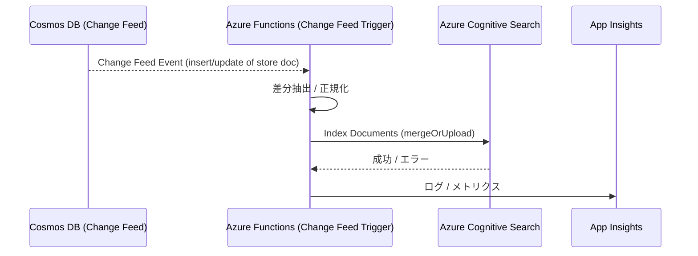

# データフロー: 検索インデックス更新

## 1. 目的
- SNS／Google Places から取得し Cosmos DB に保存した最新データを Azure Cognitive Search に反映し、フロントの全文検索・タグ検索を高速化する。
- 参照資料: `architecture/ArchitectureCurrent.md`, `architecture/DataFlow_SNS_AI.md`, `architecture/DataFlow_GooglePlaces.md`, `product/RequirementsDefinition.md`.

## 2. シーケンス概要
> バッチ処理: Cosmos Change Feedを最大100件/バッチで処理し、5分以内にSearchへ反映。ベクトル埋め込みはAzure OpenAIのEmbedding APIで再計算。

## 3. 詳細ステップ
1. **Change Feed トリガー**
   - SNS要約やPlaces詳細がCosmos DB `stores` コレクションに upsert されると Change Feed にイベントが出力。
   - Change Feed トリガーFunctionsがイベントバッチを受信。

2. **差分マッピング**
   - インデックスに必要なフィールド（店舗名、カテゴリ、雰囲気タグ、位置情報、AI要約など）を抽出。
   - ベクトル検索を利用する場合は、OpenAI Embedding等を再計算して `vector` フィールドに格納。

3. **Cognitive Search 更新**
   - 1バッチ最大100件で `mergeOrUpload` を実行。ベクトル検索を利用する場合、OpenAI Embedding APIで512次元ベクトルを生成し `vector` フィールドに格納。
   - 失敗時は指数バックオフ（1s, 3s, 9s）で3回再試行。連続失敗でアラートを送信し、手動再処理キューへ登録。

4. **キャッシュ連動**
   - インデックス更新後、Redis `geo:bounds:*` など関連キーを削除または再生成して最新検索結果を反映。

5. **監視**
   - Application Insightsに成功件数・失敗件数・処理遅延を記録。
   - Search サービスのインデックスステータスを週次でチェックし、容量上限に近い場合はSKUを見直す。

## 4. エラー時のフェイルバック
- Search更新失敗時は、フロントからCosmos直読みで最低限の検索結果を提供するパスを用意（限定ユーザー規模のため暫定措置で可）。
- エラーが続く場合は手動で `search/indexes/{name}/docs/index` API を呼び、原因（スキーマ変更など）を調査。

## 5. TODO / 次アクション
1. Functions 用の Change Feedバインディング設定と、インデックス更新スクリプトの雛形を作成。
2. ベクトル埋め込み生成の有無を決め、必要なら同じFunctions内で実装。
3. 失敗時の通知（メール/Slack）と再処理キュー（Storage Queueなど）を整備。
4. `docs/product/Roadmap.md` のデータフロー詳細タスクに本ドキュメントを紐付け、実装計画へ反映。
