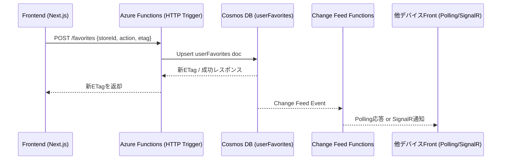

# データフロー: お気に入り・ユーザーデータ同期

## 1. 目的

- フロントエンドで行ったお気に入り操作を Azure Functions 経由で Cosmos DB に永続化し、ETagベースの差分同期で複数デバイスを同期する。
- 参照: `architecture/ArchitectureCurrent.md`, `architecture/CacheStrategy.md`.

## 2. シーケンス概要

> 同期方法: 初期段階では差分ポーリング（`/favorites?since=`）を採用。将来SignalR通知へ切り替える可能性あり。

## 3. 詳細ステップ

1. **リクエスト受付**
   - フロントは「お気に入り追加/削除」をAPI (`POST /api/favorites`) に送信。
   - Bodyには `storeId`, `note`, `action(add/remove)`, `etag` (前回のバージョン) を含める。

2. **Cosmos DB 書き込み**
   - FunctionsがユーザーIDでパーティションされた `userFavorites` コンテナに upsert。
   - `timestamp` フィールドを更新し、履歴/差分取得に利用。

3. **ローカルキャッシュ**
   - フロントはLocalStorage/IndexedDBに `favorites` と `etag` を保存。
   - `/favorites?since=` を用いて差分を取得し、Cosmosの `action` (`add` / `remove`) に従って更新。

4. **Change Feed 同期**
   - Cosmos Change Feed を監視するFunctionsが `storeIds` の差分を検出。
   - 他デバイス向けに SignalR または `/favorites?since=timestamp` で差分同期APIを提供。

5. **フロント同期フロー**
   - アプリ起動時に `/favorites?since=lastSync` を呼び、差分と最新ETagを取得。
   - ローカルStorageのキャッシュを更新し、UIに反映。SignalR導入時はPushでトリガー。

## 4. エラー処理

- Cosmos書き込み失敗時はリトライし、失敗継続ならユーザーにメッセージを表示。
- Change Feed Functions でエラーが出た場合、再処理キュー（Azure Storage Queue）に積んで再実行。
- 409 Conflict が返却された場合は最新ETagでリトライするようクライアントに指示。

## 5. TODO / 次アクション

1. APIスキーマ（`storeId`, `note`, `action`, `etag`）とCosmosドキュメント構造（`{userId, items[], etag}`）を定義。
2. SignalRを導入するか、ポーリング差分APIで十分か決める。
3. アクセス制御（招待制ユーザーのみ）のフィルターをFunctionsに実装。
4. フロント側でLocalStorageキャッシュと差分同期処理を実装し、テストを書く。
