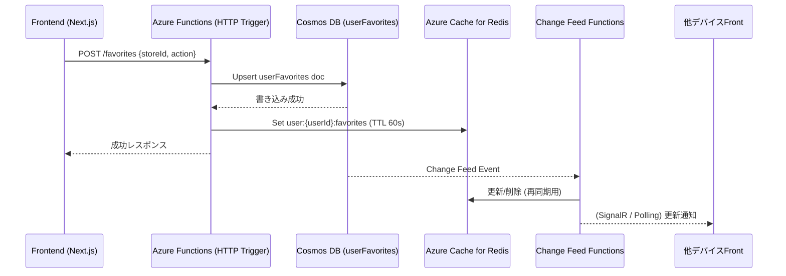

# データフロー: お気に入り・ユーザーデータ同期

## 1. 目的
- フロントエンドで行ったお気に入り操作を Azure Functions 経由で Cosmos DB に永続化し、Redis と Change Feed を使ってマルチデバイス同期を実現する。
- 参照: `architecture/ArchitectureCurrent.md`, `architecture/CacheStrategy.md`.

## 2. シーケンス概要

## 3. 詳細ステップ
1. **リクエスト受付**
   - フロントは「お気に入り追加/削除」をAPI (`POST /api/favorites`) に送信。
   - Bodyには `storeId`, `note`, `action(add/remove)` を含める。

2. **Cosmos DB 書き込み**
   - FunctionsがユーザーIDでパーティションされた `userFavorites` コンテナに upsert。
   - `timestamp` フィールドを更新し、履歴/差分取得に利用。

3. **Redisキャッシュ**
   - `user:{userId}:favorites` キーに最新リストを保存 (TTL 60秒)。
   - APIレスポンスはRedisヒットを優先し、Cosmos読み込みを最小化。

4. **Change Feed 同期**
   - Cosmos Change Feed を監視するFunctionsが `storeIds` の差分を検出。
   - 他デバイス向けに SignalR または `/favorites?since=timestamp` で差分同期APIを提供。

5. **フロント同期フロー**
   - アプリ起動時に `/favorites?since=lastSync` を呼び、Cosmosから差分取得。
   - ローカルStorageのキャッシュを更新し、UIに反映。

## 4. エラー処理
- Cosmos書き込み失敗時はリトライし、失敗継続ならユーザーにメッセージを表示。
- Redis更新失敗はログのみ（Cosmosが正とする）。
- Change Feed Functions でエラーが出た場合、再処理キュー（Azure Storage Queue）に積んで再実行。

## 5. TODO / 次アクション
1. APIスキーマ（`storeId`, `note`, `action`）とCosmosドキュメント構造（`{userId, storeIds[], timestamps[]}`）を定義。
2. SignalRを導入するか、ポーリング差分APIで十分か決める。
3. アクセス制御（招待制ユーザーのみ）のフィルターをFunctionsに実装。
4. フロント側でLocalStorageキャッシュと差分同期処理を実装し、テストを書く。
